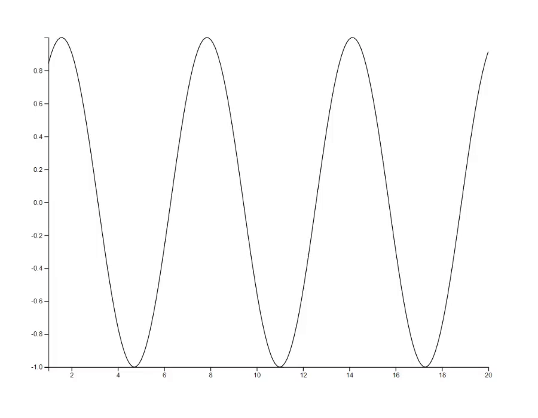

## R package 'animate': A web-based graphics device for animated visualisation

[[Package website]](https://kcf-jackson.github.io/animate/) 
[[News]](#news)
[[Introduction]](#introduction)
[[Features]](#features)
[[Usage and Examples]](#usage-and-examples)
[[⭐Gallery]](#gallery)
[[Acknowledgement]](#acknowledgement)


### News

03/02/2023: Publish on CRAN

07/08/2022: Add support to chained transition

22/07/2022: Add a simple video editor based on FFMPEG for editing screenshots

20/07/2022: Add support to detached interactive events (experimental) 

- Detached events are events that can function without R

17/07/2022: Minor updates

- Add support to interactive events (experimental)
- Add Gallery to `readme.md`

23/06/2022: [Poster Presentation at UseR!2022 Conference](man/useR2022_poster)

12/06/2022: Minor updates

- Fix an issue related to single value input.
- Add support to HTML objects.

02/03/2022: Fix an issue related to clicking during animation.

09/02/2022: Update R Markdown document and Shiny integration.

- Support using `animate` directly in a code chunk of an R Markdown document.
- Replace `load_animate()` and `setup_animate()` by `animateOutput(...)` to be consistent with the standard Shiny usage.


### Introduction

Animated visualisation is a powerful tool for capturing complex space-time dynamics. Yet animating visualisations in real time and beyond XY plots, as in the case of agent-based models for instance, remains challenging with the current R graphics system. The R package 'animate' implements a new web-based graphics device to enable flexible real-time animated visualisation in R. 
 
Utilising the R-to-JavaScript transpilation provided by the [`sketch`](https://github.com/kcf-jackson/sketch) package, the device allows users to take full advantage of the [`d3`](https://d3js.org/) JavaScript library using the R base plot syntax. The base plot syntax is extended and adapted to support animation, including both frame-by-frame option and motion tweening options. There is little new to learn other than the differences between static and animated plots, and users can get productive quickly.
 
The device integrates well with Shiny and R Markdown Documents, making it easy to create responsive and shareable applications online or as a standalone HTML document.


### Features

1. Support frame-by-frame and motion-tween animations
2. Real-time update (in contrast to pre-rendering)
3. Uses dynamic scale
4. Based on the `base` plot syntax, extended by three arguments: `id`, `transition`, and `style`
5. Deployment
    - Support R Markdown Document (HTML document output)
    - Support Shiny app (for interactivity)
    - Support screencast to MP4 video output, which can be converted to other formats with `ffmpeg`


### Usage and Examples

#### i. Installation and Setup

```{r}
# Installation
remotes::install_github("kcf-jackson/animate")

# Setup
library(animate)
device <- animate$new(width = 600, height = 400)  # takes ~0.5 second to launch
attach(device)
```


#### ii. Frame-by-frame animation

Frame-by-frame animation is re-plotting many times with a for-loop.

```{r}
# Plotting the sine curve
x <- seq(1, 40, 0.1)
y <- sin(x * pi / 6)
plot(x, y, type="l", id="line-1")

# Update the plot with the same id
for (n in 41:200) {
  new_x <- seq(1, n, 0.1)
  new_y <- sin(new_x * pi / 6)
  plot(new_x, new_y, type="l", id="line-1")
  Sys.sleep(0.02)   # about 50 frames per second
}
```




#### iii. Motion-tween animation

Motion-tween / key-frame animation is re-plotting with transition option enabled.

```{r}
# Plot 10 points at random locations
x <- 1:10
y <- 10 * runif(10)

# Give each point an ID
id <- new_id(y, prefix="points") 
plot(x, y, bg="orange", id=id)

# Update the plot with transition animation
new_y <- 10 * runif(10)
points(x, new_y, bg="blue", id=id, transition=TRUE)

# Update the plot with specific transition animation
new_y <- 10 * runif(10)
points(x, new_y, bg="green", cex=(1:10)*30, id=id, transition=list(duration = 2000))
```


### Gallery

#### 1. Lorenz system [[code]](https://github.com/kcf-jackson/animate/blob/gh-pages/examples/lorenz_system/lorenz.R)


#### 2. Mathematical rose [[code]](https://github.com/kcf-jackson/animate/blob/gh-pages/examples/mathematical_rose/roses.R) [[tutorial]](https://kcf-jackson.github.io/animate/articles/mathematical_rose.html)


#### 3. Hilbert curve [[code]](https://github.com/kcf-jackson/animate/blob/gh-pages/examples/hilbert_curve/hilbert_curve.R) [[tutorial]](https://kcf-jackson.github.io/animate/articles/hilbert_curve.html)


#### 4. Particle system [[code]](https://github.com/kcf-jackson/animate/blob/gh-pages/examples/particle_system/particle_system.R) 


#### 5. Predator-Prey process [[code]](https://github.com/kcf-jackson/animate/blob/gh-pages/examples/predator_prey/predator_prey.R)


#### 6. Schelling's model of segregation [[code]](https://github.com/kcf-jackson/animate/blob/gh-pages/examples/schelling_segregation/segregation.R)


#### 7. Maze generation [[code]](https://github.com/kcf-jackson/animate/blob/gh-pages/examples/maze_generation/maze.R) [[tutorial]](https://kcf-jackson.github.io/animate/articles/maze_generation.html)


#### 8. Chess [[code]](https://github.com/kcf-jackson/animate/blob/gh-pages/examples/chess_board/chess.R)


#### 9. "Hand-drawn" plots [[code]](https://github.com/kcf-jackson/animate/blob/gh-pages/examples/handdrawn_plots/handdrawn_plot.R)


#### 10. The science of sentencing [[code]](https://github.com/kcf-jackson/animate/blob/gh-pages/examples/science_of_sentencing/main.R) [[reference]](https://www.themarshallproject.org/2015/08/04/the-new-science-of-sentencing)


#### 11. Fairness in Machine Learning [[code]](https://github.com/kcf-jackson/animate/blob/gh-pages/examples/fairness_in_machine_learning/app.R) [[reference]](https://bair.berkeley.edu/blog/2018/05/17/delayed-impact/)


#### 12. Berlin Marathon [[code]](https://github.com/kcf-jackson/animate/blob/gh-pages/examples/berlin_marathon/marathon.R) [[reference]](http://interaktiv.morgenpost.de/berlin-marathon-2016/)


#### 13. 2048
[[code]](https://github.com/kcf-jackson/animate/blob/gh-pages/examples/2048/2048_animate.R) [[reference]](https://play2048.co/)


## Acknowledgement

This work is supported by my position at the [Bioinformatics and Cellular Genomics lab (BioCellGen)](https://www.svi.edu.au/research_themes/bioinformatics_and_cellular_genomics/) at the St. Vincent's Institute of Medical Research (SVI) under the supervision of [Davis McCarthy](https://www.svi.edu.au/research_themes/research_staff/dr_davis_mccarthy).
